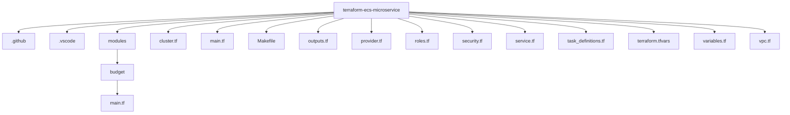

# terraform-ecs-microservice

Projeto de Infraestrutura como Código (IaC) para provisionar e implantar uma arquitetura de microserviços multi-container na AWS usando Terraform e ECS.

Este repositório define um ambiente completo, pronto para produção, com:

- VPC e rede
- Cluster ECS
- Task Definitions para múltiplos serviços
- IAM Roles
- Security Groups
- Estrutura modular em Terraform

---

## 🎯 Propósito

Este projeto demonstra como:

- Provisionar infraestrutura em nuvem com Terraform
- Implantar múltiplos microserviços containerizados no AWS ECS
- Organizar código Terraform usando módulos reutilizáveis
- Aplicar boas práticas de DevOps e Cloud em um cenário real

Projeto de portfólio para demonstrar:

- Arquitetura em nuvem
- Infraestrutura como Código (IaC)
- Orquestração de containers
- Gerenciamento de recursos na AWS

---

## 🧱 Architecture Overview

The infrastructure provisions:

- **VPC** with public and private networking
- **ECS Cluster** to run microservices
- **ECR Images** (external to Terraform – built and pushed beforehand)
- **Task Definitions** for each service
- **IAM Roles** for ECS execution and tasks
- **Security Groups** for controlled access
- **Service definitions** to keep containers alive

High-level flow:

Local Machine → Terraform → AWS API → ECS Cluster → Containers running microservices

---

## 📂 Project Structure

---

## 📁 File Responsibilities

provider.tf – AWS provider configuration  
variables.tf – Input variables  
terraform.tfvars – Environment-specific values  
vpc.tf – Networking (VPC, subnets, routing)  
cluster.tf – ECS Cluster definition  
task_definitions.tf – ECS task definitions  
service.tf – ECS services  
roles.tf – IAM roles and policies  
security.tf – Security groups  
outputs.tf – Terraform outputs  
modules/budget – Cost control / budget module  
Makefile – Automation shortcuts

---

## ⚙️ Requirements

- Terraform >= 1.x
- AWS CLI configured
- AWS account with permissions for ECS, ECR, IAM, VPC and CloudWatch
- Docker images already pushed to ECR

---

## 🚀 How to Run

terraform init  
terraform plan  
terraform apply

To destroy everything:

terraform destroy

---

## 🔐 Security & Costs

- IAM roles follow least privilege principle
- Security groups restrict inbound access
- Budget module helps prevent unexpected cloud costs

---

## 🧠 Design Decisions

- Terraform modules used for reusable components
- ECS chosen for managed container orchestration
- Infrastructure separated by responsibility files for maintainability
- No hardcoded secrets (everything via variables)

---

## 🛠 Future Improvements

- Remote backend with S3 + DynamoDB lock
- CI/CD pipeline for Terraform
- Blue/Green deployment strategy
- Auto Scaling policies for ECS services
- Observability stack (CloudWatch + tracing)

---

## 📌 Status

Project is under active development and continuous refactoring.  
This repository is part of a personal DevOps & Cloud portfolio.
