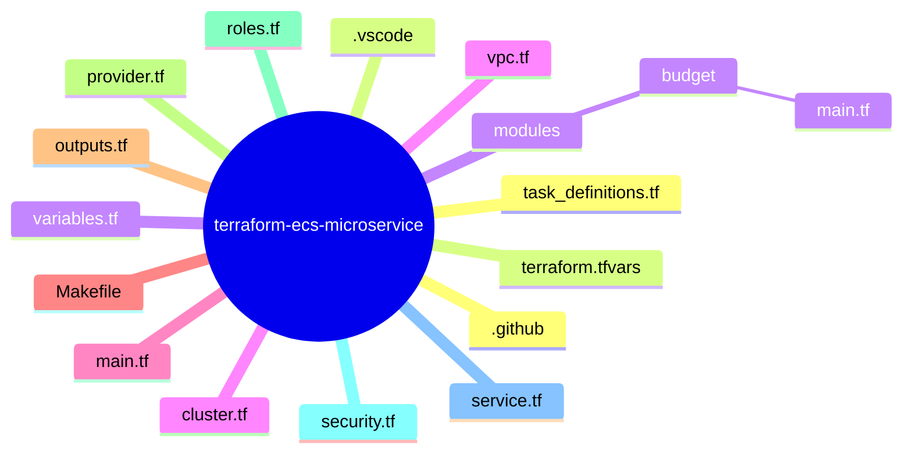

# terraform-ecs-microservice

Infrastructure as Code (IaC) project to provision and deploy a multi-container microservices architecture on AWS using Terraform and ECS.

This repository defines a complete production-ready environment with:
- VPC and networking
- ECS Cluster
- Task Definitions for multiple services
- IAM Roles
- Security Groups
- Modular Terraform structure

---

## 🎯 Purpose

This project demonstrates how to:
- Provision cloud infrastructure using Terraform
- Deploy multiple containerized microservices on AWS ECS
- Organize Terraform code using reusable modules
- Apply DevOps and Cloud best practices in a real-world setup

It is designed as a portfolio project to showcase:
- Cloud architecture
- Infrastructure as Code
- Container orchestration
- AWS resource management

---

## 🧱 Architecture Overview

The infrastructure provisions:
- **VPC** with public and private networking
- **ECS Cluster** to run microservices
- **ECR Images** (external to Terraform – built and pushed beforehand)
- **Task Definitions** for each service
- **IAM Roles** for ECS execution and tasks
- **Security Groups** for controlled access
- **Service definitions** to keep containers alive

High-level flow:

Local Machine → Terraform → AWS API → ECS Cluster → Containers running microservices

---

## 📂 Project Structure

---

## 📁 File Responsibilities

provider.tf – AWS provider configuration  
variables.tf – Input variables  
terraform.tfvars – Environment-specific values  
vpc.tf – Networking (VPC, subnets, routing)  
cluster.tf – ECS Cluster definition  
task_definitions.tf – ECS task definitions  
service.tf – ECS services  
roles.tf – IAM roles and policies  
security.tf – Security groups  
outputs.tf – Terraform outputs  
modules/budget – Cost control / budget module  
Makefile – Automation shortcuts  

---

## ⚙️ Requirements

- Terraform >= 1.x  
- AWS CLI configured  
- AWS account with permissions for ECS, ECR, IAM, VPC and CloudWatch  
- Docker images already pushed to ECR  

---

## 🚀 How to Run

terraform init  
terraform plan  
terraform apply  

To destroy everything:

terraform destroy  

---

## 🔐 Security & Costs

- IAM roles follow least privilege principle  
- Security groups restrict inbound access  
- Budget module helps prevent unexpected cloud costs  

---

## 🧠 Design Decisions

- Terraform modules used for reusable components  
- ECS chosen for managed container orchestration  
- Infrastructure separated by responsibility files for maintainability  
- No hardcoded secrets (everything via variables)  

---

## 🛠 Future Improvements

- Remote backend with S3 + DynamoDB lock  
- CI/CD pipeline for Terraform  
- Blue/Green deployment strategy  
- Auto Scaling policies for ECS services  
- Observability stack (CloudWatch + tracing)  

---

## 📌 Status

Project is under active development and continuous refactoring.  
This repository is part of a personal DevOps & Cloud portfolio.
